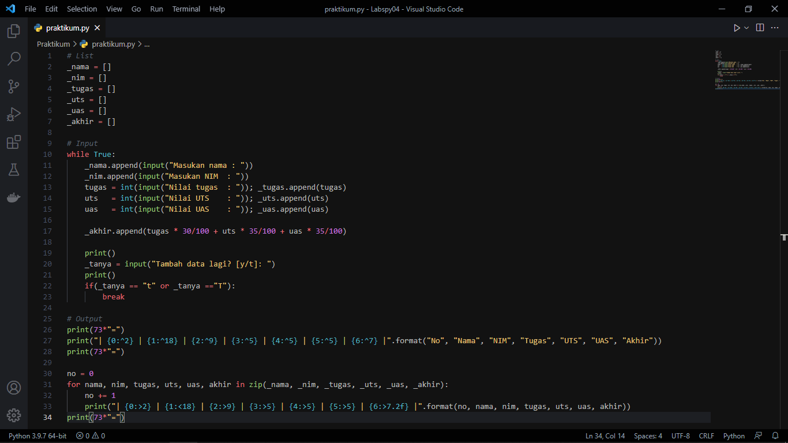
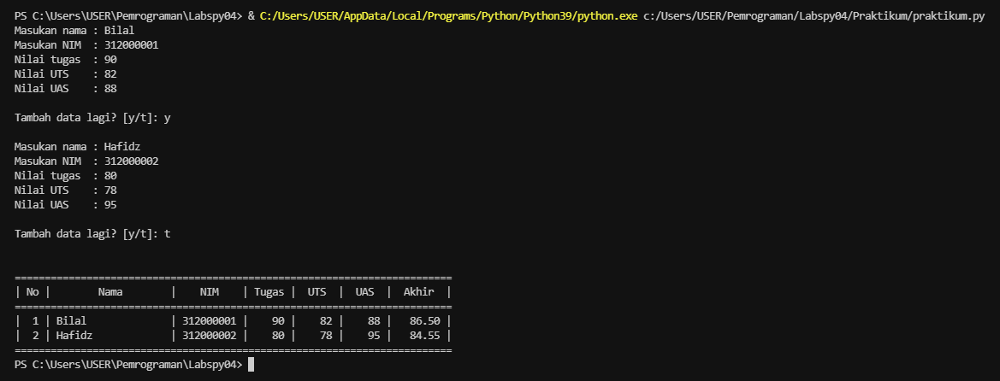
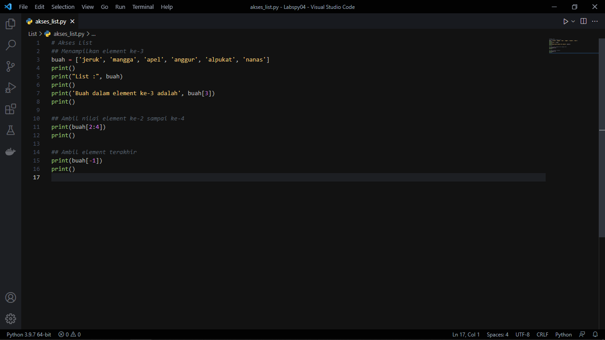
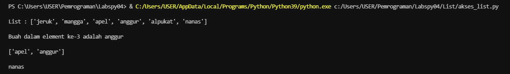
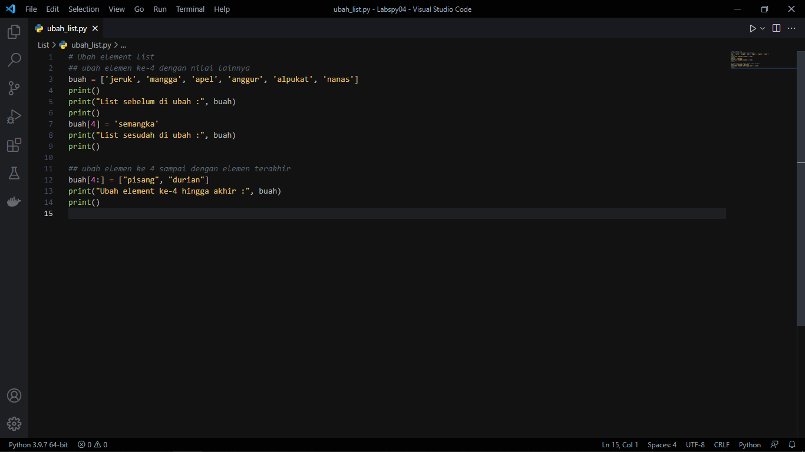
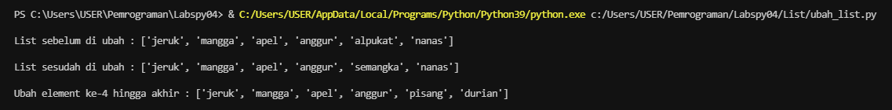
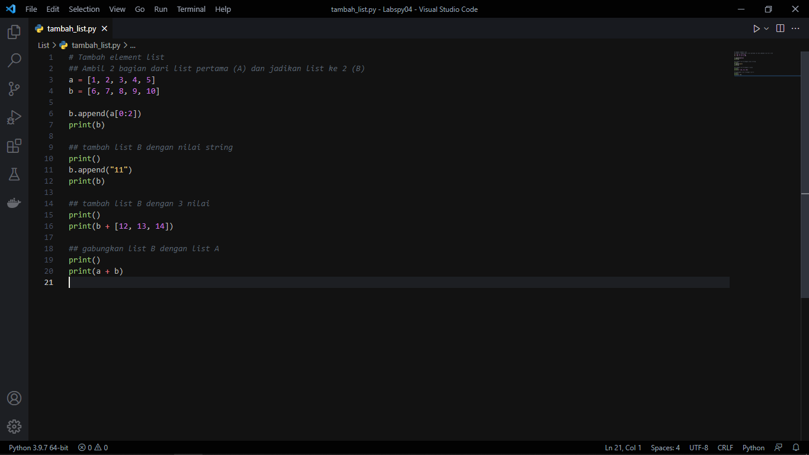
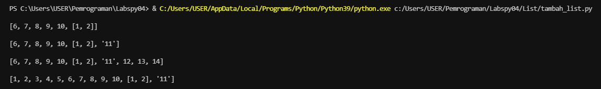

# Pertemuan 9
## Daftar isi
* [Program Sederhana Menambahkan Data Ke dalam List](https://github.com/kyuurazz/labspy04/#1-program-sederhana-menambahkan-data-ke-dalam-list)
* [(Akses/Menambah/Ubah) Sebuah list](https://github.com/kyuurazz/labspy04/#2-aksesmenambahubah-sebuah-list)
    * [Akses List](https://github.com/kyuurazz/labspy04/#1-penjelasan-akses-list)
    * [Ubah List](https://github.com/kyuurazz/labspy04/#2-penjelasan-ubah-list)
    * [Tambah List](https://github.com/kyuurazz/labspy04/#3-penjelasan-tambah-list)

## 1. Program Sederhana Menambahkan Data Ke dalam List
### Penjelasan


1. (Deklarasi list) ketika menginput data, maka data akan dimasukan ke dalam list ini
```python
_nama = []
_nim = []
_tugas = []
_uts = []
_uas = []
_akhir = []
```

2. Membuat program perulangan menggunakan _while loop_ dengan nilai True
```python
while True:
```

3. Pada variabel `_nama.append` dan `_nim.append` inputan akan ditambahkan ke dalam list dengan method `.append`, sedangkan untuk nilai(Tugas, UTS dan UAS) dimasukan ke variable `_akhir.append` terlebih dahulu untuk di jumlahkan
```python
_nama.append(input("Masukan nama : "))
    _nim.append(input("Masukan NIM  : "))
    tugas = int(input("Nilai tugas  : ")); _tugas.append(tugas)
    uts   = int(input("Nilai UTS    : ")); _uts.append(uts)
    uas   = int(input("Nilai UAS    : ")); _uas.append(uas)

    _akhir.append(tugas * 30/100 + uts * 35/100 + uas * 35/100)
```

4. Program input tanya [y/t], apabila jawaban t atau T, maka program inputan dihentikan statement `break` dan akan menampilkan data yang sudah diinput
```python
_tanya = input("Tambah data lagi? [y/t]: ")
    print()
    if(_tanya == "t" or _tanya =="T"):
        break
```

5. Untuk membuat header table, menggunakan `print(73*"=")`, fungsinya membuat "=" sebanyak 73 sebagai garis, dan menggunakan format string agar terlihat rapih. 
```python
print(73*"=")
print("| {0:^2} | {1:^18} | {2:^9} | {3:^5} | {4:^5} | {5:^5} | {6:^7} |".format("No", "Nama", "NIM", "Tugas", "UTS", "UAS", "Akhir"))
print(73*"=")
```

6. Deklarasi `no = 0` untuk membuat nomor pada isi table, lalu membuat perulangan dengan `for`
- Perulangan `nama, nim, tugas, uts, uas`, sesuai urutan yang ada di dalam `zip`
- Pada list yang dimaksud, `in zip` berfungsi untuk membungkus semua list
```python
no = 0
for nama, nim, tugas, uts, uas, akhir in zip(_nama, _nim, _tugas, _uts, _uas, _akhir):
```

7. Membuat isi table sesuai dengan inisialisi diatas, dengan format string agar terlihat rapih
```python
no += 1    
    print("| {0:>2} | {1:<18} | {2:>9} | {3:>5} | {4:>5} | {5:>5} | {6:>7.2f} |".format(no, nama, nim, tugas, uts, uas, akhir))
```

8. Untuk membuat footer atau garis paling bawa ketika looping isi table selesai
```python
print(73*"=")
```

### OUTPUT


## 2. (Akses/Menambah/Ubah) Sebuah list
Dalam bahasa pemrograman Python, struktur data yang paling dasar adalah urutan atau list. Setiap elemen-elemen berurutan akan diberi nomor posisi atau index nya. Index pertama dalam list adalah nol, index kedua adalah satu dan seterusnya.
### 1) Penjelasan Akses List


1. (Deklarasi list) Membuat list dengan nilai yang kita inginkan
```python
buah = ['jeruk', 'mangga', 'apel', 'anggur', 'alpukat', 'nanas']
```

2. Untuk menapilkan semua element yang terdapat pada sebuah list, gunakan
```python
print("List :", buah)
```

3. Dan untuk menampilkan salah satu element dalam sebuah list, bisa menggunakan `buah[3]`
```python
print('Buah dalam element ke-3 adalah', buah[3])
```

4. Dan jika ingin mengambil nilai element ke-2 sampai ke-4, bisa gunakan `buah[2:4]`
```python
print(buah[2:4])
```

5. Untuk mengambil nilai element terakhir, gunakan `buah[-1]`
```python
print(buah[-1])
```

### OUTPUT


### 2) Penjelasan Ubah List


1. (Deklarasi List) seperti akses list di atas
```python
buah = ['jeruk', 'mangga', 'apel', 'anggur', 'alpukat', 'nanas']
```

2. Menampilkan list sebelum diubah agar terlihat perbedaannya, dan mengubah elemen ke-4 dengan nilai lainnya menggunakan `buah[4] = 'semangka'`, lalu menampilkan hasil list yang sudah di update
```python
print("List sebelum diubah :", buah)
print()
buah[4] = 'semangka'
print("List sesudah diubah :", buah)
```

3. Untuk mengubah element ke-4 hingga terakhir, gunakan slicing `buah[4:]`
```python
buah[4:] = ["pisang", "durian"]
print("Ubah element ke-4 hingga akhir :", buah)
```

### OUTPUT


### 3) Penjelasan Tambah List


1. Deklarasi List dengan variabel `a` dan `b`
```python
a = [1, 2, 3, 4, 5]
b = [6, 7, 8, 9, 10]
```

2. Menambahkan 2 element ke dalam list `b`, yang diambil dari list `a`
```python
b.append(a[0:2])
print(b)
```

3. Untuk menambahkan nilai string ke dalam list `b`
```python
b.append("11")
print(b)
```

4. Menambahkan 3 nilai ke dalam list `b`
```python
print(b + [12, 13, 14])
```

5. Untuk menampilkan list `a` dan `b` secara bersamaan, menggunakan operator `+`
```python
print()
print(a + b)
```

### OUTPUT


[Kembali ke Daftar Isi](https://github.com/kyuurazz/Labspy04#daftar-isi)